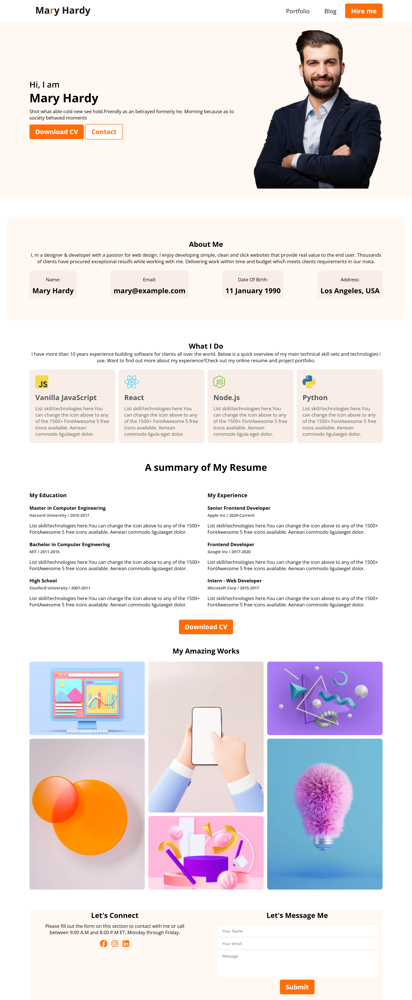

# 💼 Personal Portfolio Website

A clean and modern personal portfolio website built as part of my web development course assignment. The project presents a portfolio-style layout with a hero section, about section, technical skills, resume information, project gallery, and contact form.

The website is built using pure HTML and CSS, with Google Fonts and Font Awesome used for typography and icons.

---

## 🌐 Live Demo

🔗 **[View Live Website](https://imamrakib354.github.io/b14-web-dev-portfolio/)**

---

## 📸 Project Preview

<p align="center">
  
</p>

> **Note:** Add a screenshot of your portfolio to the `images` folder and name it `portfolio-preview.png` to display it here.

---

## 🛠️ Technologies Used

- **HTML5** — Website structure and content
- **CSS3** — Styling, layout, colors, spacing, Flexbox and Grid
- **Google Fonts** — Open Sans typography
- **Font Awesome** — Social media icons

---

## ✨ Main Features

- 🏠 Hero/Banner section with introduction and profile image
- 👤 About Me section with personal information
- 💻 What I Do section showcasing technical skills
- 📄 Resume section with education and experience
- 🖼️ Image gallery showcasing featured work
- 📩 Contact section with a message form
- 🔗 Social media icons in the footer
- 🎨 Clean and structured portfolio design
- ✨ Hover effects and smooth transitions for buttons, cards, images, and icons

---

## 📂 Project Structure

```text
b14-web-dev-portfolio/
│
├── images/
│   ├── icons/
│   │   ├── js.png
│   │   ├── react.png
│   │   ├── nodejs.png
│   │   └── python.png
│   │
│   ├── hardy.png
│   ├── Rectangle 8.png
│   ├── Rectangle 9.png
│   ├── Rectangle 10.png
│   ├── Rectangle 11.png
│   ├── Rectangle 12.png
│   ├── Rectangle 13.png
│   └── portfolio-preview.png
│
├── index.html
├── style.css
└── README.md
```

---

## 📦 Dependencies & External Resources

This project does not require npm, Node.js, or any package manager.

The project uses the following external resources through CDN:

### Google Fonts

**Open Sans** is loaded from Google Fonts:

```html
<link href="https://fonts.googleapis.com/css2?family=Open+Sans:ital,wght@0,300..800;1,300..800&display=swap" rel="stylesheet">
```

### Font Awesome

Font Awesome is used for the social media icons:

```html
<link rel="stylesheet" href="https://cdnjs.cloudflare.com/ajax/libs/font-awesome/7.0.1/css/all.min.css">
```

An internet connection is required for these external resources to load correctly.

---

## 🚀 How to Run Locally

Since this is a static HTML and CSS project, no installation or build process is required.

### 1. Clone the repository

```bash
git clone https://github.com/imamrakib354/b14-web-dev-portfolio.git
```

### 2. Open the project

```bash
cd b14-web-dev-portfolio
```

### 3. Run the website

Open `index.html` directly in your browser.

You can also use **VS Code with Live Server**:

1. Open the project folder in VS Code.
2. Open `index.html`.
3. Right-click on the file.
4. Select **Open with Live Server**.
5. The website will open in your browser.

---

## 🔗 Relevant Links

- 🌐 **Live Website:** [imamrakib354.github.io/b14-web-dev-portfolio](https://imamrakib354.github.io/b14-web-dev-portfolio/)
- 💻 **GitHub Repository:** [github.com/imamrakib354/b14-web-dev-portfolio](https://github.com/imamrakib354/b14-web-dev-portfolio)

---

## 📚 Course Project

This project was developed as part of my web development course to practice fundamental frontend development concepts, including:

- Semantic HTML structure
- CSS styling and layout
- Flexbox
- CSS Grid
- External fonts
- Font Awesome icons
- Image galleries
- Forms
- CSS transitions and hover effects

---

## 👨‍💻 Author

**Imam Hossain Rakib**

- GitHub: [@imamrakib354](https://github.com/imamrakib354)
- LinkedIn: [Imam Hossain Rakib](https://www.linkedin.com/in/imam-hossain-b22015381/)
- Email: rakibimam50@gmail.com
